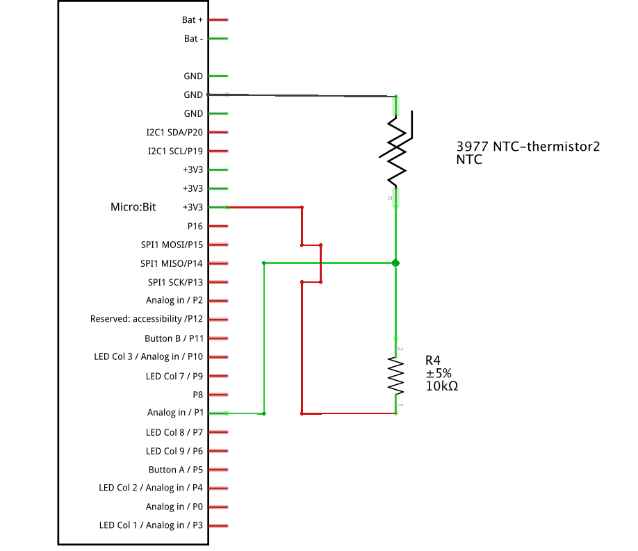
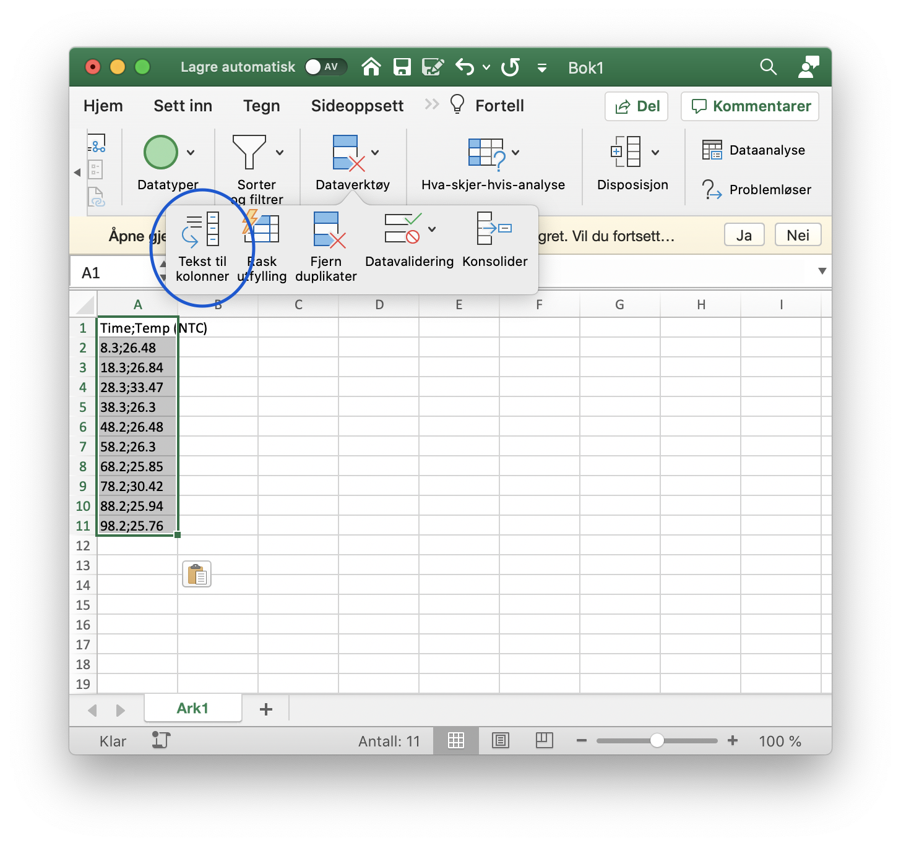

# Temperaturmåling med micro:bit og NTC sensor

I denne repoen finner du to skript lar deg måle og registrere temperaturer med en NTC-sensor og micro:bit. Dataene kan lagres direkte i filsystemet til micro:biten eller på et eksternt minnekort ved hjelp av en [SparkFun OpenLog](https://learn.sparkfun.com/tutorials/openlog-hookup-guide). På grunn av plassbegrensninger på micro:biten er du nødt til å velge om du ønsker å bruke skriptet som skriver til micro:biten eller til minnekort.

Skriptene er tilpasset NTC-termistoren som ble levert til CanSat 2018 (se <https://www.narom.no/undervisningsressurser/the-cansat-book/v3/> )

## Oppsett for intern lagring på microbit

### Oppkobling for intern lagring på micro:bit

Koble opp kretsen slik koblingsskjemaet over viser (du kan også se det i nedre høyre hjørne av figuren lenger nede).

### Oppsett av skript for intern lagring

Last ned skriptet `main-internal-recording.py`. Dette skriver data direkte til minnet på micro:biten. Hvis jeg har regnet riktig så er det plass til omtrent 2200 måleverdier i micro:biten sitt lagringssystem. Åpne skriptet i [Mu](https://codewith.mu/en/) og gjør nødvendige tilpasninger:

- sleeptime er intervallet mellom hver måling i millisekunder
- filnavn er filnavnet til fila med måleresultater på micro:biten
- R_ref er verdien (i Ohm) på resistansen som kobles i serie med NTC-sensoren
- Pin_NTC er satt til pin1. Bruk denne standardverdien hvis du måler spenningen over NTCen på pin1 på micro:biten.
- A, B, C og D er variabler som du velger ut fra hvilken type NTC du har. Standardverdiene er tilpasset NTCen som ble levert i [CanSat kitet i 2018](https://www.narom.no/undervisningsressurser/the-cansat-book/v3/). Databladet for denne finner du [her](https://www.vishay.com/docs/29049/ntcle100.pdf). Standardverdiene er hentet fra side 4, hvor du finner verdiene A_1, B_1, C_1 og D_1 tilhørende varianten med B_(25/85) = 3977.

Overfør skriptet til micro:biten ved å trykke på `Flash`-knappen i Mu. 

### Bruk ved intern lagring

Hold inne `a`-knappen for å starte dataloggingen. Displayet viser hvilket filnavn dataene skrives til. Displayet viser deretter en avrundet temperaturmåling i celsius for hver måling. Avslutt målingen ved å trykke på `b`-knappen. Displayet viser en hake når dataloggingen er ferdig.

Du kan slette alle de innhentede dataene ved å riste på micro:biten til den viser et spøkelse på displayet. Deretter holder du inne begge knappene fram til displayet gir beskjed om at alt er slettet.

### Overføre måleresultater til PC

Koble micro:bit til PCen og åpne [Mu](https://codewith.mu/en/). Trykk på `Files` og dra over datafilene fra micro:biten til PCen. Datafilene er lagret som csv-filer som kan importeres til regnearkprogrammer som Microsoft Excel.

## Oppsett for lagring til OpenLog

### Oppkobling for lagring til OpenLog og bruk av OLED

Koble opp kretsen slik figuren viser. Det kan være lurt å sørge for at strømmen ikke har for lang vei NTCen og OpenLogen. Begge er ømfintlige for små spenningsvariasjoner. Jeg har opplevd bedre resultater ved å koble VCC-kontakten på OpenLog direkte til en av 3,3 V pinnene på micro:biten. 

### Oppsett av skript for lagring på OpenLog

Last ned skriptet `main-openlog-oled.py`. Dette skriver data direkte til et [microSD-minnekort](https://no.wikipedia.org/wiki/MicroSD). Minnekortet kan leses av med en minnekortleser koblet til PC/Mac eller nettbrett/smarttelefon. Dataene blir skrevet til minnekortet ved hjelp av en [OpenLog](https://learn.sparkfun.com/tutorials/openlog-hookup-guide)

- Use_OLED = True dersom du har en 0,96 tommers 128x64 OLED-skjerm som du ønsker å bruke til å overvåke dataloggingen. Dette kan være kjekt siden en skjerm kan gi god informasjon om hva micro:biten registrer.  Bruk av OLED krever at du laster ned modulene fra https://github.com/fizban99/microbit_ssd1306 (du trenger bare ssd1306.py og ssd1306_text.py). Last disse modulene over til microbiten din ved hjelp av filer-verktøyet i Mu eller ved hjelp av [ufs (microfs)](https://microfs.readthedocs.io/en/latest/).
- sleeptime er intervallet mellom hver måling i millisekunder. Hvis du ikke bruker en OLED-skjerm så bruker micro:biten lang tid (> 8 sekunder) på å vise tid og temperatur. Hvis du ønsker hyppigere målinger bør du endre skriptet slik at denne informasjonen ikke vises på displayet.
- R_ref er verdien (i Ohm) på resistansen som kobles i serie med NTC-sensoren
- Pin_NTC er satt til pin1. Bruk denne standardverdien hvis du måler spenningen over NTCen på pin1 på micro:biten.
- Pin_TX og Pin_RX må korrespondere med riktige pins på microbiten. Pin_TX på micro:bit kobles til RX1 på OpenLogen.
- A, B, C og D er variabler som du velger ut fra hvilken type NTC du har. Standardverdiene er tilpasset NTCen som ble levert i [CanSat kitet i 2018](https://www.narom.no/undervisningsressurser/the-cansat-book/v3/). Databladet for denne finner du [her](https://www.vishay.com/docs/29049/ntcle100.pdf). Standardverdiene er hentet fra side 4, hvor du finner verdiene A_1, B_1, C_1 og D_1 tilhørende varianten med B_(25/85) = 3977.

Overfør skriptet til micro:biten ved å trykke på `Flash`-knappen i Mu og legg over filene `ssd1306.py` og `ssd1306_text.py` ved hjelp av `Files`-funksjonen i Mu.

### Bruk

Jeg anbefaler å sette inn et microSD-kort i OpenLogen før du kobler til strøm. Det kan være lurt å koble OpenLog direkte til en av 3,3 V kontaktene på micro:biten (den krever en del strøm, og fungerer ofte ikke for meg når den koblet til strøm fra [breadboardet](https://en.wikipedia.org/wiki/Breadboard). Koble så en 5 V strømkilde til USB-kontakten på micro:biten. OpenLog krever minst 3,3 V, slik at 2 stk LR06 AA-batteri på 1,5 V ikke vil gi nok spenning.

Micro:biten viser et sovende ansikt på LED-displayet når den ikke lagrer data. Hold inne `a`-knappen for å starte dataloggingen. Tid og temperatur vises i displayet. Trykk `b`-knappen for å avslutte dataloggingen.

## Analysere data i Microsoft Excel

Kopier dataene dine fra tekstfila eller .csv-fila til Microsoft Excel. Marker cellene med data og velg `Tekst til kolonner` fra `Data`-fanen. Se skjermbildet.

Du får nå opp en veiviser som går gjennom tre steg. I det første steget bekrefter du at dataene dine er adskilt med skilletegn. I neste steg markerer du at dataene er adskilt med semikolon. I trinn 3 av 3 er det viktig at du trykker `Avansert` og bytter ut desimalskilletegnet fra komma til punktum. Trykk fullfør, så skal dataene dine vises i hver sin kolonne.