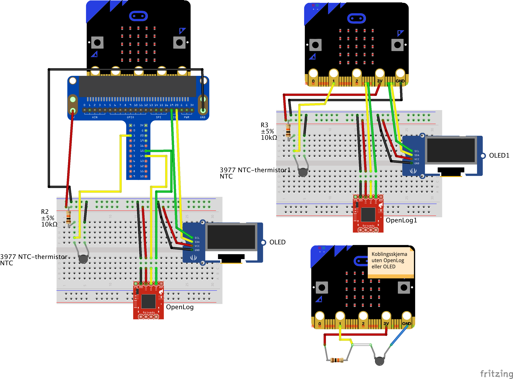

Temperaturmåling med micro:bit og NTC sensor
============================================

Dette skriptet lar deg måle og registrere temperaturer med en NTC-sensor og microbit. Dataene kan lagres direkte i filsystemet til micro:biten eller på et eksternt minnekort ved hjelp av en SparkFun OpenLog.

Skriptet er tilpasset NTC-termistoren som ble levert til CanSat 2018 (se <https://www.narom.no/undervisningsressurser/the-cansat-book/v3/> )

Oppsett
=======

Oppkobling
----------

Oppsett av variabler
--------------------

- OpenLog = True hvis du ønsker å bruke SparkFun openlog til å lagre data fra temperatursensoren. Dersom denne settes til False vil dataene lagres direkte på Microbiten som du kan hente ut ved å bruke verktøyet ufs (microfs) eller filer-verktøyet i Mu.
- Use_OLED = True dersom du har en 0,96 tommers 128x64 OLED-skjerm som du ønsker å bruke til å overvåke dataloggingen. Dette kan være kjekt siden man ellers ikke vet hva micro:biten registrerer før man leser av datafilen i etterkant. Bruk av OLED krever at du laster ned modulene fra https://github.com/fizban99/microbit_ssd1306 (du trenger bare ssd1306.py og ssd1306_text.py). Last disse modulene over til microbiten din ved hjelp av filer-verktøyet i Mu eller ved hjelp av ufs (microfs).
- R_ref er verdien (i Ohm) på resistansen som kobles i serie med NTC-sensoren
- Pin_NTC, TX og RX må korrespondere med riktige pins på microbiten

Bruk
====

Micro:biten viser et sovende ansikt på LED-displayet når den ikke lagrer data. Under dataloggingen vil microbiten vise et kryss for å indikere at den er opptatt. Hvis LED-displayet viser en pil mot høyre er micro:biten i ferd med å bytte modus fra OpenLog til intern lagring eller vice versa.

Hold nede a-knappen for å starte datalogging. Slipp knappen når displayet viser et kryss.

Hold nede b-knappen for å avbryte avslutte lagringen av data. Slipp knappen når displayet viser et sovende ansikt.

Hold nede a- og b-knappen samtidig for å bytte output fra OpenLog til intern lagring eller vice versa. Slipp knappene så fort displayet viser en pil. 